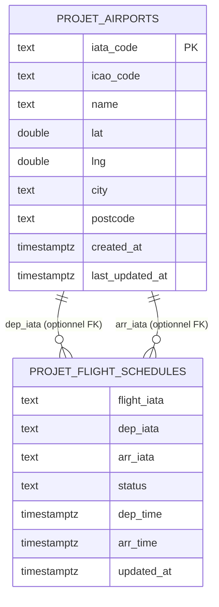

# Livrable 1 — Découverte des sources de données disponibles

## Contexte

Le projet **DST Airlines** vise à mettre en place un **pipeline de données automatisé** pour le **suivi des vols** et des **infrastructures aéroportuaires**, afin de **cartographier et comprendre** les données disponibles dans l’écosystème de l’**aéronautique commerciale** (sources, couverture, granularité, limites et qualité).

Ce livrable correspond à l’étape *“Découverte des sources de données disponibles”* : identification, exploration, premiers tests, limites/contraintes et exemples de données collectées.

## Périmètre du projet (MVP)

- **Données vols** : horaires (prévu/estimé/réel), statuts (scheduled/active/landed/cancelled), aéroports départ/arrivée, compagnie/numéro de vol, éléments de retard quand disponibles.
- **Données aéroports** : référentiel aéroports (codes IATA/ICAO), coordonnées GPS (lat/lng), enrichissements (ville, code postal).
- **Historisation** : capacité à accumuler un historique jour après jour pour entraîner un futur modèle.
- **Exclusions (à ce stade)** : couche “Gold” BI non prioritaire, intégration météo et modèle ML non inclus dans ce livrable.

## Problématiques “retard” visées (pistes d’analyse)

- **Classement des compagnies** (retards moyens, taux de retards, volatilité)
- **Classement des aéroports** (retards au départ/à l’arrivée, hubs vs régionaux)
- **Vols à retard chronique** (récurrence par numéro/route)
- **Causes de retard** (codes/raisons quand disponibles, ex. codes AHM 780 côté AFKLM)

## État de l’art (panorama des sources possibles)

Pour construire un dataset “retard” robuste, on distingue généralement :

- **Sources “officielles” compagnies / aéroports**  
  Données souvent riches (statuts, événements, parfois motifs de retard), mais **contraintes de quotas** et **couverture limitée** (une compagnie / un réseau).

- **Agrégateurs aviation (multi-compagnies)**  
  Exemple : AirLabs (schedules/airports). Avantage : **harmonisation** et **couverture large**. Inconvénients : dépendance à l’agrégateur, champs parfois moins détaillés qu’une source officielle.

- **Données ADS-B ouvertes (tracking)**  
  Exemple : OpenSky Network. Ces sources donnent plutôt la **position** et la **trajectoire** (state vectors/tracks) que les **retards officiels**. Elles sont utiles en *complément* (ex. détection de “holding patterns”, retards opérationnels) mais ont des **restrictions légales et techniques** (licence, quotas, couverture).
  - Doc API REST : `https://openskynetwork.github.io/opensky-api/rest.html`
  - Terms of Use / Data license : `https://opensky-network.org/index.php/about/terms-of-use`

- **Enrichissements géographiques et contextuels**  
  Pour relier vols ↔ météo ↔ territoire, il faut souvent transformer des coordonnées GPS en informations “humaines” (ville, code postal).  
  Dans ce projet, l’enrichissement est réalisé via **Nominatim (OpenStreetMap)** (reverse geocoding) dans `2_silver_processing/silver_airports_geo.py`.

## Stratégie de collecte : pourquoi ces sources ?

L’équipe a initialement ciblé trois acteurs majeurs : **Air France-KLM**, **Lufthansa** et **AirLabs**.

### Période de recherche & contraintes de sélection (benchmark)

La phase de *découverte/benchmark* des sources s’est déroulée sur le démarrage du projet, avec un objectif simple : **identifier rapidement des sources exploitables** (documentation accessible, quotas compatibles avec une collecte répétée, données pertinentes pour le suivi des vols et l’analyse des retards).

Critères utilisés pour qualifier une source :

- **Disponibilité & onboarding** : inscription, accès API, documentation, stabilité.
- **Pertinence “aviation commerciale”** : vols (statut/horaires), aéroports, niveau de détail.
- **Couverture** : multi-compagnies vs “source officielle” (une compagnie).
- **Contraintes** : quotas/jour, pagination, latence/erreurs, payant vs gratuit.
- **Opérationnalisation** : possibilité d’automatiser une collecte (daily append) et de stocker en base.

#### Synthèse des sources explorées (extrait du benchmark)

| Source | API | Données “base” | Gratuité / quota (observé) | Commentaire | Décision |
|---|---:|---:|---|---|---|
| Aviationstack API | Oui | Non | ~100 requêtes free | Quota trop faible pour accumuler de l’historique | Non retenu |
| AirLabs | Oui | Oui | ~1000 requêtes free | Bon compromis coverage/mise en route ; endpoints airports/schedules | **Retenu (candidat)** |
| Amadeus for Developers | Oui | Non | ~2000 requêtes free | Plutôt orienté “voyage/réservation” ; possible flight-status mais quota limitant | Non prioritaire |
| Lufthansa Open API | Oui | - | Free | Onboarding bloqué (clé API non obtenue) | **Annulé** |
| Air France-KLM OpenData | Oui | - | Free (quota/jour + pagination) | Source **officielle**, très riche sur statuts/legs/irrégularités | **Retenu (candidat)** |
| Flight API (générique) | Oui | - | Payant | Coût non compatible avec le démarrage | Non retenu |
| OpenSky Network | Oui | Oui | Free (licence + quotas) | Données ADS‑B tracking ; pas orienté “retard” directement | Non retenu (complément possible) |
| Aviation Edge | Oui | Oui | Payant | Payant | Non retenu |
| Google Flights API (SerpApi) | Oui | Non | Free | Orienté recherche billets | Non retenu |
| Kaggle (datasets) | Non | Oui | n/a | Source de datasets (historique), pas une API temps réel | À garder en “backup” |
| OurAirports (open data) | Non | Oui | n/a | Référentiel aéroports (open data) | Backup / enrichissement |
| data.gouv.fr (trafic mensuel FR) | Non | Oui | n/a | Agrégats mensuels ; pas du suivi fin vol par vol | Hors scope MVP |
| Flightradar24 API | - | - | Payant | Payant | Non retenu |
| AeroAPI (FlightAware) | Oui | - | Payant | Payant | Non retenu |

> Remarque : ce tableau synthétise la *phase de benchmark* (contraintes/positionnement). Les chiffres “free” dépendent des plans et peuvent évoluer.

### Air France-KLM (prioritaire)

**Pourquoi ce choix (analyse)** : Air France‑KLM est retenu comme source prioritaire car elle combine :

- **Source officielle** : données publiées par la compagnie (fiabilité et cohérence des statuts/horaires).
- **Richesse fonctionnelle** : structure très détaillée (legs, times, aéroports, irrégularités, champs de retard), utile autant pour le suivi que pour des analyses avancées.
- **Disponibilité** : API documentée (OpenAPI disponible), accessible via clé API, gratuite au démarrage.
- **Exploitable pour historiser** : pagination + fenêtre temporelle permettant de planifier des collectes quotidiennes.

En contrepartie, l’API ne couvre que le périmètre du groupe Air France‑KLM (pas “tous les vols mondiaux”), d’où l’intérêt d’un **complément multi-compagnies** (AirLabs).

**API** : Flight Status API (OpenData)  
- Endpoint principal (recherche par fenêtre temporelle) : `GET /flightstatus`  
- Endpoint détail (par identifiant de vol) : `GET /flightstatus/{flightId}`

La spécification OpenAPI utilisée pour l’exploration est conservée dans :
- `documentation/AFKLM/features_getflights_AFKLM.json`

#### Paramètres — `GET /flightstatus` (fenêtre temporelle)

Paramètres principaux (tirés de la spec OpenAPI du repo, et cohérents avec les tests réalisés) :

| Paramètre | Requis | Description | Exemple |
|---|---:|---|---|
| `startRange` | Oui | Date/heure de début (ISO 8601) | `2026-01-01T00:00:00.000Z` |
| `endRange` | Oui | Date/heure de fin (ISO 8601) | `2026-01-02T00:00:00.000Z` |
| `movementType` | Non | Focus : `A` (arrival) / `D` (departure) | `A` |
| `timeOriginType` | Non | Référence : `S`cheduled, `M`odified, `I`nternal, `P`ublic | `S` |
| `timeType` | Non | Format temps : `U` (UTC) / `L` (Local) | `U` |
| `origin` | Non | Aéroport de départ (IATA) | `AMS` |
| `destination` | Non | Aéroport d’arrivée (IATA) | `CDG` |
| `carrierCode` | Non | Filtre compagnie (IATA/ICAO) | `AF`, `KL` |
| `flightNumber` | Non | Filtre numéro de vol (souvent 4 digits) | `0605` |
| `pageSize` | Non | Nb d’éléments/page (souvent 100) | `100` |
| `pageNumber` | Non | Pagination (0…N) | `0` |
| Header `API-Key` | Oui | Clé API Air France-KLM | *(secret)* |

Exemple de requête (pseudo-curl) :

```bash
curl -H "Accept: application/hal+json" \
     -H "API-Key: <AFKLM_API_KEY>" \
     "https://api.airfranceklm.com/opendata/flightstatus?startRange=2026-01-01T00:00:00.000Z&endRange=2026-01-02T00:00:00.000Z&pageNumber=0"
```

#### Paramètres — `GET /flightstatus/{flightId}` (détail)

| Paramètre | Requis | Description | Exemple |
|---|---:|---|---|
| `flightId` (path) | Oui | Identifiant : `yyyyMMdd+carrierCode+flightNumber+operationalSuffix` | `20260111+AF+0605` |
| Header `API-Key` | Oui | Clé API Air France-KLM | *(secret)* |
| Header `Accept-Language` | Non | Langue de réponse | `en-GB` |

#### Limites (quotas / pagination)

Lors des tests, la contrainte principale est un **quota journalier** (ex. ~100 appels/jour) et un **pageSize typique à 100** éléments/page.  
Conséquence : un maximum d’environ **10 000 vols/jour** est récupérable par clé (ordre de grandeur).

**Stratégie adoptée** (extrait du notebook `0_exploration/air_france_klm/AFKLM_extract_data.ipynb`) :
- Faire un **premier appel par journée** (janvier 2026) pour obtenir `totalPages`
- Puis planifier l’extraction page par page (`pageNumber=0..totalPages`)
- Utiliser **plusieurs clés/API apps** (workers) pour paralléliser et contourner les limites

#### Contraintes liées à la période de recherche (fenêtre temporelle)

Points d’attention constatés sur la collecte “par journée” :

- **Fenêtre obligatoire** : l’endpoint nécessite `startRange` et `endRange` (ISO 8601). Nous avons standardisé des fenêtres **J → J+1** (par jour) pour contrôler le volume.
- **Pagination par jour** : le nombre de pages varie fortement selon les journées (donc le coût API aussi).
- **Risque de trous** : certaines journées/pages peuvent manquer (erreurs 500/504, ou quota atteint avant la fin).  
  Cela influence directement l’historique obtenu pour une période donnée (ex. janvier 2026).
- **Conséquence opérationnelle** : la collecte doit être conçue comme un processus **rejouable** (retries) et suivi (tracking des pages déjà extraites).

#### Contraintes observées (qualité de service)

Certains appels renvoient des erreurs **500/504** non déterministes, laissant supposer des instabilités côté API.  
Impact : journées/pages manquantes. Mitigation :
- accepter quelques trous dans l’historique,
- retenter plus tard,
- compléter via une autre source (AirLabs) pour certaines analyses.

#### Champs utiles “retard” (focus projet)

Les réponses AFKLM sont très “nested”. Les champs ci-dessous sont ceux identifiés comme les plus utiles pour la suite (ex. modélisation, features) :

- **Identité & contexte vol**
  - `id`, `flightNumber`, `flightScheduleDate`
  - `airline.code`, `airline.name`
  - `route[]`
- **Statut**
  - `flightStatusPublic` (ex. `ARRIVED`, `ON_TIME`, `CANCELLED`, `PARTIALLY_CANCELED`)
  - `flightLegs[].publishedStatus`, `flightLegs[].legStatusPublic`
- **Horaires (prévu/estimé/réel)**
  - `flightLegs[].departureInformation.times.*`
  - `flightLegs[].arrivalInformation.times.*`
- **Retard / irrégularités**
  - `flightLegs[].departureDateTimeDifference`, `flightLegs[].arrivalDateTimeDifference` (format ISO 8601 duration, ex. `PT5M`)
  - `flightLegs[].irregularity.delayInformation[]` (codes/durée)
  - `flightLegs[].irregularity.delayReasonCodePublic[]` (quand présent)

Ces champs sont illustrés dans `samples/afklm_flightstatus_sample.json`.

### Lufthansa (annulé)

**Statut** : source annulée.  
**Problème rencontré** : inscription sur le portail développeur impossible (non-réception du mail de confirmation), donc aucune clé API et impossibilité d’effectuer les tests.

### AirLabs (remplacement — tests concluants)

**Motivation** : disposer rapidement d’une source **multi-compagnies** pour valider l’architecture et constituer un référentiel d’aéroports (notamment France).

**Endpoints utilisés** :
- **Airports DB** : `https://airlabs.co/api/v9/airports` (référentiel aéroports)  
  Doc : `https://airlabs.co/docs/airports`
- **Schedules** : `https://airlabs.co/api/v9/schedules` (horaires/queue de départ)  
  Doc : `https://airlabs.co/docs/schedules`


#### Paramètres utilisés dans le pipeline (AirLabs)

**Airports**  
Objectif : constituer un référentiel initial d’aéroports (France) :
- appel type : `GET /airports?country_code=FR`
- champs attendus en staging : `iata_code`, `icao_code`, `name`, `lat`, `lng`

**Schedules**  
Objectif : collecter les horaires/stats par grands hubs :
- appel type : `GET /schedules?dep_iata=CDG` (et autres hubs)
- champs attendus en staging : `flight_iata`, `dep_iata`, `arr_iata`, `status`, `dep_time`, `arr_time`

> Note importante : la doc AirLabs indique des limites qui dépendent du plan et du type de requête (paramètre `limit`). Notre script force `limit=100`. Si votre clé est “Free”, il faudra peut‑être ajuster ce `limit` (cf. doc).

## Architecture technique (pipeline)

### Choix d’architecture : Medallion (sans Gold à ce stade)

Pour le démarrage, nous restons sur du **code Python** (Airflow/dbt discutés mais non requis au démarrage).  
L’architecture cible reste compatible avec l’industrialisation (Airflow pour l’orchestration, dbt pour les transformations SQL).

### Couches de données

**Bronze / Staging (PostgreSQL dans le MVP actuel)**  
- Objectif : stocker les données brutes ingérées depuis AirLabs en tables “staging”.
- Dans `ingestion_airlabs.py`, les tables sont écrasées ou append selon le flux.
- Tables utilisées :
  - `staging.stg_projet_airports`
  - `staging.stg_projet_schedules`

**Silver / Acquisition (PostgreSQL)**
- Objectif : structurer, nettoyer, dédoublonner, historiser, enrichir.
- Scripts :
  - `2_silver_processing/silver_flights_clean.py`
  - `2_silver_processing/silver_airports_geo.py`
- Tables cibles :
  - `acquisition.projet_airports` (dimension aéroports, historisée + enrichie)
  - `acquisition.projet_flight_schedules` (facts horaires/stats, upsert)

### Enrichissement géographique (bonus)

Problème : certaines données “aéroports” fournissent des coordonnées GPS mais pas toujours une adresse exploitable pour un croisement météo (ville/code postal).

Solution implémentée : `2_silver_processing/silver_airports_geo.py`
- Reverse geocoding via Nominatim (OpenStreetMap) :  
  `https://nominatim.openstreetmap.org/reverse?format=json&lat=<lat>&lon=<lon>&addressdetails=1`
- Throttling : `time.sleep(1.2)` pour limiter la charge et respecter les quotas.

Résultat : mise à jour de `acquisition.projet_airports` avec :
- `city`
- `postcode`
- `last_updated_at`

### Schéma (ER / UML simplifié)

Le schéma ci-dessous correspond aux tables SQL fournies dans `documentation/livrable_1/sql/` et aux scripts Python du repo.



> Note : les FK sont “optionnelles” dans le MVP, car le référentiel aéroports peut être partiel (ex. seulement France). Dans ce cas, une contrainte FK stricte sur `arr_iata` peut être trop restrictive.


## Exemples de données collectées (samples)

Les extraits ci-dessous sont fournis en fichiers (sanitisés) dans `documentation/livrable_1/samples/`.

### AirLabs — Airports

Fichier : `samples/airlabs_airports_sample.json`

Champs clés utilisés dans le pipeline :
- `iata_code`, `icao_code`, `name`, `lat`, `lng`, `country_code`

### AirLabs — Schedules

Fichier : `samples/airlabs_schedules_sample.json`

Champs clés utilisés dans le pipeline :
- `flight_iata`, `dep_iata`, `arr_iata`, `status`, `dep_time`, `arr_time` (+ variantes UTC/estimated/actual)

### Air France-KLM — FlightStatus

Fichier : `samples/afklm_flightstatus_sample.json`

Extrait représentatif basé sur les exemples observés lors des collectes (vol multi-legs, statuts, irrégularités, champs de retard).

## Notes d’industrialisation (Airflow & dbt)

- **Démarrage** : scripts Python (déjà présents) pour prouver l’extraction + stockage + transformations.
- **Évolution logique** :
  - Orchestration avec **Airflow** (DAG quotidien, gestion retries, monitoring).
  - Transformations SQL avec **dbt** (modèles, tests, documentation, lineage).
  - Stabilisation Bronze : stockage JSON brut (ex. MongoDB / JSONB Postgres) pour “replay” sans ré-appels API.

## Annexes — Références utiles

- AirLabs Airports docs : `https://airlabs.co/docs/airports`
- AirLabs Schedules docs : `https://airlabs.co/docs/schedules`
- OpenSky REST API : `https://openskynetwork.github.io/opensky-api/rest.html`
- OpenSky Terms of Use : `https://opensky-network.org/index.php/about/terms-of-use`

