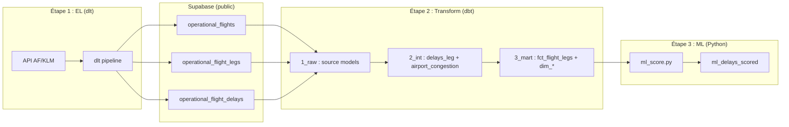

# Pipeline AFKLM complet : dlt + dbt + ML pour la prédiction des retards

## Vue d'ensemble de la pipeline




---

## Rôle de chaque composant

- **dlt** : Extract & Load. Appelle l'API AF/KLM, flatten la réponse JSON et charge dans 3 tables normalisées (Option B) dans Supabase.
- **dbt** : Transform. Source models (raw), calcul des retards et features de congestion (int), schéma en étoile avec toutes les features nécessaires au ML (mart).
- **ML (Python)** : Lit `mart.fct_flight_legs`, entraîne/applique un modèle de classification (`is_delayed`), écrit les prédictions dans `ml_delays_scored`.

---

## Analyse du notebook de.ipynb et décisions ML

### Ce que le notebook fait bien (à garder)

- Classification binaire `is_delayed = delayDuration >= 15 min` : standard industrie
- Features de congestion aéroportuaire (nb vols départ/arrivée par aéroport/jour)
- Features temporelles : `departureWeekDay`, `departureMonth`, `departureHour`
- `scheduledFlightDuration` parsé en minutes
- Approche pour les codes aéroport (trop de catégories → proxy via agrégations)

### Ce que le notebook ne fait pas (à ajouter)

- Aucun modèle entraîné (s'arrête à SelectKBest)
- Pas de train/test split
- Pas de gestion du déséquilibre de classes
- Doublons dus au LEFT JOIN avec irregularity (plusieurs delays par leg)
- Features calculées en Python au lieu de dbt
- `aircraftCode` absent du schéma dbt actuel

### Décisions pour le plan

- Les features de congestion (`nbFlightDeparting`, `nbFlightArriving`) seront calculées dans **dbt (int)** et non en Python
- `aircraftCode` sera ajouté dans la table `operational_flight_legs` (dlt) et propagé dans le mart
- `scheduledFlightDuration` sera parsé en minutes dans dbt (int)
- Le ML lira depuis `mart.fct_flight_legs` (pas les tables brutes)
- Le modèle sera un Random Forest ou XGBoost avec `class_weight="balanced"` ou SMOTE

---

## Étapes d'implémentation

### Étape 1 : Environnement et dépendances

- Ajouter dans [requirements.txt](dst_airlines/requirements.txt) : `dlt[postgres]`, `scikit-learn`, `xgboost`, `joblib`, `imbalanced-learn`
- Initialiser dlt : `dlt init rest_api postgres` (ou structure manuelle)
- Ajouter `.dlt/secrets.toml` dans `.gitignore`

Structure attendue :

```
dst_airlines/
├── .dlt/
│   ├── config.toml
│   └── secrets.toml
├── 1_ingestion/
│   ├── afklm_dlt_pipeline.py
│   └── afklm_source.py
├── 3_ml/
│   └── ml_score.py
```

### Étape 2 : Source custom AF/KLM (3 ressources Option B)

Source custom `@dlt.source` avec 3 `@dlt.resource` correspondant aux tables Option B.

Pour chaque vol dans `operationalFlights` :

- **operational_flights** : `id`, `flight_number`, `flight_schedule_date`, `airline_code`, `airline_name`, `haul`, `route`, `flight_status_public`, `fetched_at`
- **operational_flight_legs** : `flight_id` (FK), `leg_order`, `departure_airport_code`, `arrival_airport_code`, `published_status`, `scheduled_departure`, `actual_departure`, `scheduled_arrival`, `actual_arrival`, `scheduled_flight_duration`, `cancelled`, `**aircraft_type_code`** (ajouté pour le ML, vient de `flightLegs[].aircraft.typeCode`)
- **operational_flight_delays** : `flight_leg_id` (FK), `delay_code`, `delay_duration`

Logique de pagination : fenêtres temporelles jour par jour + boucle `pageNumber`, rotation de clés API, retry sur 403/500/504.

### Étape 3 : Configuration Supabase + DDL

- Configurer `.dlt/secrets.toml` (clés API + credentials Supabase)
- Créer les 3 tables Option B dans Supabase avec `**aircraft_type_code`** ajouté dans `operational_flight_legs` :

```sql
CREATE TABLE public.operational_flight_legs (
  id UUID PRIMARY KEY DEFAULT gen_random_uuid(),
  flight_id VARCHAR(50) REFERENCES public.operational_flights(id),
  leg_order INTEGER,
  departure_airport_code VARCHAR(3),
  arrival_airport_code VARCHAR(3),
  published_status VARCHAR(50),
  scheduled_departure TIMESTAMPTZ,
  actual_departure TIMESTAMPTZ,
  scheduled_arrival TIMESTAMPTZ,
  actual_arrival TIMESTAMPTZ,
  scheduled_flight_duration VARCHAR(20),
  cancelled BOOLEAN DEFAULT FALSE,
  aircraft_type_code VARCHAR(10)          -- AJOUT pour le ML
);
```

### Étape 4 : Pipeline dlt (write disposition, PK)

- **operational_flights** : `write_disposition="merge"`, `primary_key="id"`
- **operational_flight_legs** : `write_disposition="merge"`, `primary_key="id"`
- **operational_flight_delays** : `write_disposition="merge"`, `primary_key="id"`
- `dataset_name="public"`

### Étape 5 : Chargement incrémental

- Utiliser `dlt.state()` pour stocker la dernière fenêtre traitée
- Au prochain run, reprendre après cette fenêtre

### Étape 6 : Modèles dbt adaptés pour le ML

Alignement strict avec les conventions du [README afklm-delay-pipeline](Projet_prod/afklm-delay-pipeline/README.md) :

- **Raw** : renommage, cast, calculs simples uniquement — pas de joins ni agrégations
- **Int** : toutes les transformations lourdes (joins, agrégations, colonnes calculées)
- **Mart** : fct et dim lisent **uniquement** le dernier modèle int — jamais `sources.yml`

#### 6.1 Couche raw (source models)

`sources.yml` déclare les 3 tables Option B. Chaque source model est **1:1** avec une table source.

**Transformations autorisées** : renommage, cast de types, calculs simples (ex. unix → timestamp). **Interdit** : joins, agrégations.

Exemple pour `flight_data__source_operational_flights.sql` :

```sql
-- raw.flight_data__source_operational_flights
{{ config(schema='raw', materialized='view') }}
select
    id,
    flight_number::int as flight_number,
    flight_schedule_date::date as flight_schedule_date,
    airline_code,
    airline_name,
    haul,
    route,
    flight_status_public,
    fetched_at::timestamptz as fetched_at
from {{ source('flight_data', 'operational_flights') }}
```

Idem pour `flight_data__source_operational_flight_legs.sql` et `flight_data__source_operational_flight_delays.sql` : SELECT avec cast uniquement.

#### 6.2 Couche int : 3 modèles (toutes les transformations lourdes)

**flight_data__int_delays_leg.sql** : JOIN flights + legs + delays, déduplique les legs (agrège les delays par leg), calcule `departure_delay_minutes`, `arrival_delay_minutes`, parse `scheduled_flight_duration` (ISO8601 PT2H25M → minutes). Grain = 1 ligne par leg. Lit uniquement les source models.

**flight_data__int_airport_congestion.sql** : Agrégation par aéroport par jour (nb vols départ, nb vols arrivée). Lit `flight_data__source_operational_flight_legs`.

**flight_data__int_legs_ready.sql** (dernier modèle int) : JOIN `int_delays_leg` + `int_airport_congestion` (2x : départ et arrivée). Ajoute toutes les features ML : `scheduled_flight_duration_min`, `aircraft_type_code`, `departure_weekday`, `departure_month`, `departure_hour`, `departure_monthday`, `dep_airport_nb_departing`, `dep_airport_nb_arriving`, `arr_airport_nb_departing`, `arr_airport_nb_arriving`, `is_delayed` (CASE when delay >= 15). Grain = 1 ligne par leg. **C'est le seul modèle que le mart lit.**

#### 6.3 Couche mart : fct et dim lisent uniquement le dernier int

**fct_flight_legs** : SELECT sur `flight_data__int_legs_ready` avec renommage des colonnes pour les FK (airline_key, departure_airport_key, etc.). **Aucune transformation** — toute la logique est dans int.

```sql
-- mart.fct_flight_legs
{{ config(schema='mart', materialized='table') }}
select
    flight_id,
    flight_number,
    airline_code as airline_key,
    departure_airport_code as departure_airport_key,
    arrival_airport_code as arrival_airport_key,
    flight_schedule_date as date_key,
    scheduled_departure,
    actual_departure,
    scheduled_arrival,
    actual_arrival,
    cancelled,
    delay_code,
    delay_duration_minutes,
    departure_delay_minutes,
    arrival_delay_minutes,
    scheduled_flight_duration_min,
    aircraft_type_code,
    departure_weekday,
    departure_month,
    departure_hour,
    departure_monthday,
    dep_airport_nb_departing,
    dep_airport_nb_arriving,
    arr_airport_nb_departing,
    arr_airport_nb_arriving,
    is_delayed
from {{ ref('flight_data__int_legs_ready') }}
```

**dim_airlines**, **dim_airports**, **dim_date** : lisent depuis `flight_data__int_legs_ready` (ou un autre int si pertinent), jamais depuis sources.

### Étape 7 : Script ML (ml_score.py)

Basé sur le notebook `de.ipynb`, refactorisé en script propre. Lit depuis `mart.fct_flight_legs`.

**Pipeline ML :**

1. **Lecture** : `SELECT * FROM mart.fct_flight_legs WHERE cancelled = false`
2. **Features** :
  - Numériques : `scheduled_flight_duration_min`, `departure_weekday`, `departure_month`, `departure_hour`, `departure_monthday`, `dep_airport_nb_departing`, `dep_airport_nb_arriving`, `arr_airport_nb_departing`, `arr_airport_nb_arriving`
  - Catégorielles : `airline_key`, `aircraft_type_code` (one-hot ou target encoding)
  - Aéroports : utilisés via les features de congestion (proxy), pas en one-hot
3. **Cible** : `is_delayed` (déjà calculé dans le mart)
4. **Split** : `train_test_split(stratify=y, test_size=0.2)`
5. **Déséquilibre** : `class_weight="balanced"` dans le modèle, ou SMOTE via `imbalanced-learn`
6. **Modèle** : Random Forest puis XGBoost (comparaison)
7. **Feature selection** : feature importance du modèle (remplace SelectKBest/f_classif)
8. **Évaluation** : accuracy, precision, recall, F1, AUC-ROC (surtout recall car on veut détecter les retards)
9. **Écriture** : prédictions + probabilités dans `ml_delays_scored` (Supabase)

### Étape 8 : Orchestration et intégration finale

Séquence batch :

```bash
python 1_ingestion/afklm_dlt_pipeline.py && dbt run && python 3_ml/ml_score.py
```

---

## Fichiers à créer ou modifier


| Fichier                                                                         | Action                                                                                  |
| ------------------------------------------------------------------------------- | --------------------------------------------------------------------------------------- |
| `dst_airlines/requirements.txt`                                                 | Ajouter `dlt[postgres]`, `scikit-learn`, `xgboost`, `joblib`, `imbalanced-learn`        |
| `dst_airlines/.dlt/config.toml`                                                 | Config pipeline dlt                                                                     |
| `dst_airlines/.dlt/secrets.toml`                                                | Clés API + Supabase (ne pas versionner)                                                 |
| `dst_airlines/.gitignore`                                                       | Ajouter `.dlt/secrets.toml`                                                             |
| `dst_airlines/1_ingestion/afklm_source.py`                                      | Source custom (3 ressources Option B)                                                    |
| `dst_airlines/1_ingestion/afklm_dlt_pipeline.py`                                | Pipeline principal dlt                                                                  |
| `dst_airlines/1_ingestion/ingestion_af_klm.py`                                  | Wrapper / point d'entrée                                                                |
| `afklm-delay-pipeline/models/1_raw/.../sources.yml`                             | Déclarer les 3 tables Option B                                                          |
| `afklm-delay-pipeline/models/2_int/.../flight_data__int_delays_leg.sql`         | Joins, agrégation delays, parse duration                                                |
| `afklm-delay-pipeline/models/2_int/.../flight_data__int_airport_congestion.sql` | Agrégation nb vols départ/arrivée par aéroport/jour                                     |
| `afklm-delay-pipeline/models/2_int/.../flight_data__int_legs_ready.sql`         | NOUVEAU : dernier int — join + toutes features ML (temporelles, congestion, is_delayed) |
| `afklm-delay-pipeline/models/3_mart/.../fct_flight_legs.sql`                    | SELECT sur int_legs_ready uniquement (renommage FK)                                     |
| `dst_airlines/3_ml/ml_score.py`                                                 | Script ML (basé sur de.ipynb, refactorisé)                                              |


---

## Ordre d'exécution recommandé

1. Créer les 3 tables Option B dans Supabase (avec `aircraft_type_code` ajouté)
2. Implémenter la source custom dlt et le pipeline
3. Tester dlt en local (1 jour, quelques pages)
4. Implémenter les modèles dbt (raw, int avec congestion, mart enrichi)
5. Tester `dbt run` et valider que `fct_flight_legs` contient toutes les features ML
6. Implémenter `ml_score.py` (train, evaluate, write predictions)
7. Valider la séquence complète : `dlt run && dbt run && ml_score.py`

---

## Points d'attention

- **Rate limits** : conserver `time.sleep()` et rotation de clés du notebook
- **Doublons** : le notebook `de.ipynb` a un problème de lignes dupliquées dû au LEFT JOIN avec irregularity (plusieurs delays par leg) ; le modèle dbt int doit agréger les delays par leg
- **Déséquilibre** : la majorité des vols ne sont pas en retard ; utiliser `class_weight="balanced"` ou SMOTE
- **aircraft_type_code** : champ absent du schéma actuel, à ajouter dans `operational_flight_legs` ; vient de `flightLegs[].aircraft.typeCode` dans l'API
- **Features temporelles** : calculées dans int (int_legs_ready), pas en mart ni en Python
